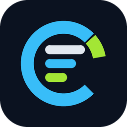

[](https://opensource.org/licenses/MIT)

**English** | [简体中文](README.zh-CN.md)

# Codex Usage




A lightweight native Windows taskbar widget for monitoring Codex usage, with optional Claude Code and Google Antigravity usage display.

It sits in your taskbar and shows how much of your Codex usage window remains without opening the Codex app or account usage page.

## What You Get

- A **5h** bar for your current Codex usage window
- A **7d** bar for your current weekly window
- Simplified Chinese display with explicit remaining usage and reset countdowns
- Optional Claude Code usage alongside Codex
- Optional Antigravity model usage bars for Google's 5-hour and weekly Gemini quota windows
- A live countdown until each limit resets
- Optional low-quota alerts at 10%, 20%, or 30% remaining, deduplicated per reset window
- Independent display controls for the 5-hour and weekly rows
- A small native widget that lives directly in the Windows taskbar
- One system tray icon that matches the desktop app icon
- Left-click the tray icon to toggle the taskbar widget on or off
- Right-click options for refresh, monitored services, usage rows, quota alerts, update frequency, language, startup, widget visibility, and updates
- Multi-monitor taskbar placement, so the widget can live on the taskbar for the screen you prefer

## Who This Is For

This app is for Windows users who already have **Codex CLI or the Codex app installed and signed in**.

Codex is enabled by default. The app reads the same local credentials used by Codex.

Antigravity support is optional too. To show Antigravity usage, install and sign in to Google Antigravity, then enable the **Antigravity** service from the right-click **Monitored services** menu.

It works best if you want a simple "how close am I to the limit?" display that is always visible.

## Requirements

- Windows 10 or Windows 11
- Codex CLI or Codex app installed and authenticated
- Optional: Claude Code installed and authenticated
- Optional: Google Antigravity installed and authenticated, if you want Antigravity usage

If you use Claude Code through WSL, that is supported too. The monitor can read your Claude Code credentials from Windows or from your WSL environment.

## Install

For a per-user installation, download `install.ps1` from the [latest release](https://github.com/upstream-ray/codex-usage-monitor/releases/latest), then run:

```powershell
powershell.exe -NoProfile -ExecutionPolicy Bypass -File .\install.ps1
```

The installer verifies the release SHA256 and installs to `%LOCALAPPDATA%\Programs\CodexUsage` without administrator access. It adds a Start menu shortcut and an entry in Windows Installed Apps.

For portable use, download `codex-usage.exe` from the same release and run it from any user-writable directory. You can also build it locally:

```powershell
cargo build --release
```

Local builds create the executable at `target\release\codex-usage.exe`.

## Uninstall

Uninstall **Codex Usage** from Windows Settings > Apps > Installed apps, or run:

```powershell
powershell.exe -NoProfile -ExecutionPolicy Bypass -File "$env:LOCALAPPDATA\Programs\CodexUsage\uninstall.ps1"
```

Uninstalling preserves `%APPDATA%\CodexUsage\settings.json`. Add `-RemoveSettings` to delete settings explicitly. See [Installation model](docs/installation.md) for upgrade, portable, startup, and WinGet behavior.

## Use

Run:

```powershell
codex-usage
```

Once running, it will appear in your taskbar and as one tray icon in the notification area.

- Drag the left divider to move the taskbar widget
- On multi-monitor setups, drag the widget onto another Windows taskbar to move it to that screen
- Right-click the taskbar widget or tray icon for refresh, monitored services, usage rows, quota alerts, update frequency, Start with Windows, reset position, language, updates, and exit
- Left-click the tray icon to toggle the taskbar widget on or off
- Enable `Start with Windows` from the right-click menu if you want it to launch automatically when you sign in

### Monitored Services

Use the right-click **Monitored services** menu to choose which independent services the widget displays. The services are not mutually exclusive, so you can monitor more than one account at the same time:

- **Codex** is enabled by default
- **Claude Code** can be enabled alongside Codex or shown by itself when Claude Code CLI is installed and authenticated
- **Antigravity** can be enabled alongside the other providers or shown by itself as its own service column

When multiple services are shown, each service has its own usage bar and matching usage text color. Antigravity prefers Google's Gemini quota summary when available and falls back to model quota data when needed.

### System Tray Icon

The app always shows one tray icon using the same embedded icon as the executable and desktop shortcut, regardless of how many services are enabled.

Hovering over the tray icon shows a compact summary for all enabled services. Left-clicking it toggles the taskbar widget; right-clicking it opens the settings menu.

### Usage Display And Alerts

Use the right-click **Usage display** menu to show both quota rows or only one. The app always keeps at least one row visible.

Use **Quota alerts** to choose a remaining-quota threshold of 10%, 20%, or 30%. Alerts are off by default. Each provider and quota window is notified only once until its reset time changes, including across app restarts.

In Simplified Chinese, the compact taskbar rows use `5h` / `7d`, one continuous progress bar, remaining percentage, and a concrete local reset value such as `18:30重置` or `07/17重置`.

## Diagnostics

If you need to troubleshoot startup or visibility issues, run:

```powershell
codex-usage --diagnose
```

This writes a log file to:

```text
%TEMP%\codex-usage.log
```

The log records the application version, install channel, executable path, polling failure category, and retry timing. It does not log access tokens or credential contents. See [Troubleshooting](docs/troubleshooting.md) for the taskbar error labels and recovery steps.

Settings are saved to:

```text
%APPDATA%\CodexUsage\settings.json
```

## Account Support

Codex usage is read from the account authenticated in the local Codex installation. Optional Claude Code monitoring works with the account types supported by Claude Code.

As of **March 19, 2026**, Anthropic's Claude Code setup documentation says:

- **Supported:** Pro, Max, Teams, Enterprise, and Console accounts
- **Not supported:** the free Claude.ai plan

If Anthropic changes Claude Code availability in the future, this app should follow whatever Claude Code supports, as long as the usage data remains exposed through the same authenticated endpoints.

## Privacy And Security

This project is **open source**, so you can inspect exactly what it does.

What the app reads:

- Your local Claude Code OAuth credentials from `~/.claude/.credentials.json`
- If needed, the same credentials file inside an installed WSL distro
- If Codex is enabled, your local Codex credentials from `$CODEX_HOME/auth.json` or `~/.codex/auth.json`
- If Antigravity is enabled, your local Antigravity OAuth token from Windows Credential Manager target `gemini:antigravity`

What the app sends over the network:

- Requests to Anthropic's Claude endpoints to read your usage and rate-limit information
- Requests to ChatGPT's Codex usage endpoint to read your Codex usage and rate-limit information, if Codex is enabled
- Requests to Google's Cloud Code / Antigravity endpoints to read your Antigravity quota information, if Antigravity is enabled
- Requests to GitHub only if you use the app's update check / self-update feature
- If proxy environment variables such as `HTTPS_PROXY`, `HTTP_PROXY`, or `ALL_PROXY` are set, those outbound requests may use that proxy

What the app stores locally:

- Widget position
- Selected taskbar / screen
- Widget visibility
- Polling frequency
- Language preference
- Last update check time
- Visible quota rows and low-quota alert threshold
- Quota-window notification keys used to prevent duplicate alerts
- Displayed model preferences

What it does **not** do:

- It does not send your credentials to any other server
- It does not use a separate backend service
- It does not collect analytics or telemetry
- It does not upload your project files
- It does not directly edit your Codex credentials file

Notes:

- If your Claude Code token is expired, the app may ask the local Claude CLI to refresh it in the background
- If your Codex token is expired, the app may ask the local Codex CLI to refresh it in the background. The monitor does not write `auth.json` itself; any credential update is handled by the Codex CLI.
- If your Antigravity token is expired, open Antigravity and sign in again. The monitor does not write Windows Credential Manager entries itself.
- Portable installs can update themselves by downloading the latest release from this repository
- Proxies should be trusted because proxied usage requests include your OAuth bearer token inside the TLS connection

## How It Works

The monitor:

1. Finds your enabled model login credentials
2. Reads your current usage from Anthropic, ChatGPT, and/or Google's Antigravity endpoints
3. Shows the result directly in the Windows taskbar
4. Keeps the widget aligned with the selected taskbar and tray area
5. Refreshes periodically in the background

If the newer usage endpoint is unavailable, it can fall back to reading the rate-limit headers returned by Claude's Messages API.

## Open Source

This project is licensed under the MIT License. The original [LICENSE](LICENSE) and copyright notice are preserved.

Codex Usage is a maintained derivative of [CodeZeno/Claude-Code-Usage-Monitor](https://github.com/CodeZeno/Claude-Code-Usage-Monitor). Thanks to Craig Constable and the upstream contributors for the original project. Changes in this repository are not affiliated with or endorsed by the upstream maintainers or OpenAI.

If you want to inspect the behavior or audit the code, everything is in this repository.
